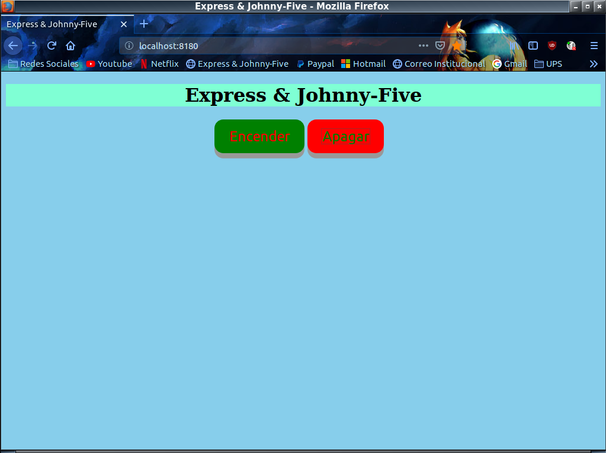

# Node.js
# Express & Johnny-five

Pequeño proyecto el cual a través de un servidor web montado sobre Node.js y haciendo uso de express nos
permite encender y apagar un led conectado a una placa Arduino UNO, para lo cual se hizo uso de la librería
Johnny five la cual se ejecuta sobre Node.js

  

Pagina que muestra nuestro servidor al usuario.
